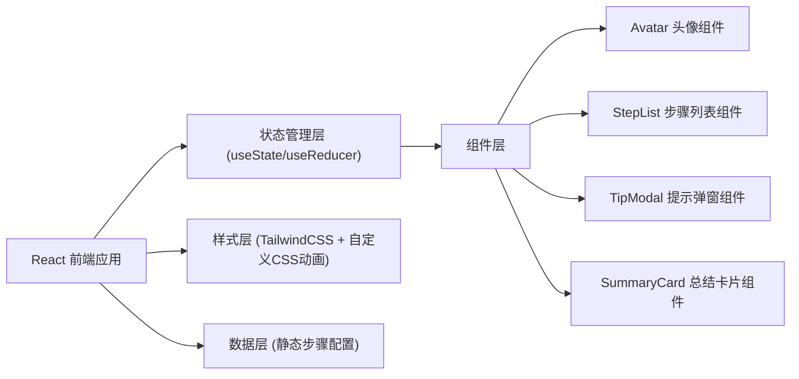

## 1. 架构设计



## 2. 技术描述

- **前端框架**：React@18 + TypeScript
- **构建工具**：Vite
- **样式方案**：TailwindCSS@3 + 自定义 CSS 动画
- **状态管理**：React useState/useReducer（轻量级，无需额外状态库）
- **图标方案**：emoji + 自定义 SVG
- **后端**：无（纯前端项目）
- **数据库**：无（静态数据配置）

## 3. 路由定义

| 路由 | 用途 |
|-------|---------|
| / | 游戏主页（单页应用，所有功能在同一页面） |

## 4. 数据模型

### 4.1 步骤数据定义

```typescript
interface MakeupStep {
  id: number;
  name: string;
  icon: string;
  description: string;
  tip: string;
  effectKey: string;
}

interface GameState {
  currentStep: number;
  completedSteps: number[];
  showTip: boolean;
  currentTip: string;
  isComplete: boolean;
}
```

### 4.2 静态步骤配置数据

```typescript
const MAKEUP_STEPS: MakeupStep[] = [
  {
    id: 1,
    name: "洁面护肤",
    icon: "🧴",
    description: "清洁面部并涂抹基础护肤品",
    tip: "护肤是化妆的基础哦！好的皮肤状态能让妆容更服帖~",
    effectKey: "skincare"
  },
  // ... 更多步骤
];
```

## 5. 组件结构

```
src/
├── components/
│   ├── Avatar/           # 卡通人物头像组件（含SVG妆容层）
│   ├── StepList/         # 化妆步骤列表组件
│   ├── StepCard/         # 单个步骤卡片组件
│   ├── TipModal/         # 小技巧提示弹窗组件
│   └── SummaryCard/      # 完成总结卡片组件
├── data/
│   └── steps.ts          # 化妆步骤静态数据
├── types/
│   └── index.ts          # TypeScript 类型定义
├── App.tsx               # 主应用组件
├── main.tsx              # 入口文件
└── index.css             # 全局样式和动画
```

## 6. 妆容效果实现方案

- 使用 SVG 绘制卡通人物基础头像
- 每个化妆步骤对应一个 SVG 图层（g 元素）
- 通过 CSS opacity 和 transform 控制妆容层的显示和动画
- 使用 React 条件渲染按步骤解锁显示各妆容层
