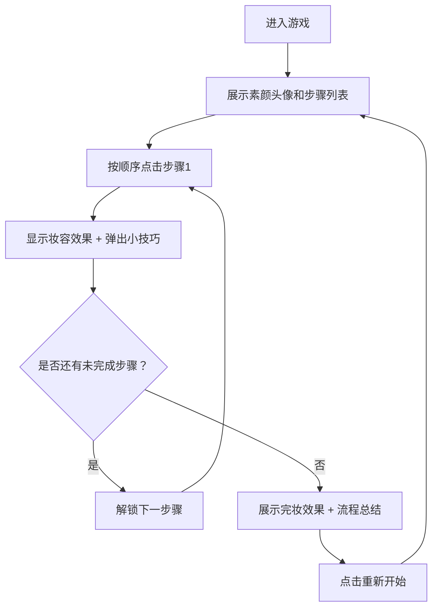

## 1. 产品概述

一款面向化妆初学者的交互式化妆教学小游戏，通过可爱卡通风格的界面和趣味互动方式，帮助用户系统了解完整的日常化妆流程。

- 目标用户：化妆新手、对化妆感兴趣的女性用户
- 核心价值：以游戏化方式降低化妆学习门槛，寓教于乐

## 2. 核心功能

### 2.1 功能模块

1. **游戏主页**：标题展示、卡通人物头像、开始游戏按钮
2. **化妆步骤区**：步骤列表展示、图标+文字说明、按顺序点击交互
3. **人物头像区**：素颜卡通头像、动态妆容叠加、步骤反馈动画
4. **科普提示区**：每步完成后弹出小技巧/科普知识
5. **完成展示区**：精致完妆效果、流程总结卡片、重新开始功能

### 2.2 页面详情

| 页面名称 | 模块名称 | 功能描述 |
|-----------|-------------|---------------------|
| 游戏主页 | 欢迎模块 | 展示游戏标题、卡通人物预览、开始按钮、装饰元素 |
| 游戏主页 | 人物头像模块 | SVG 绘制的卡通素颜头像，可叠加各层妆容效果 |
| 游戏主页 | 步骤列表模块 | 8-10个化妆步骤卡片，按顺序解锁点击 |
| 游戏主页 | 提示弹窗模块 | 步骤完成后弹出化妆小技巧，带淡入淡出动画 |
| 游戏主页 | 完成展示模块 | 全妆效果展示、流程总结卡片、重新开始按钮 |

## 3. 核心流程

用户进入游戏 → 看到素颜卡通人物和步骤列表 → 按顺序点击第一个步骤（护肤/打底）→ 人物面部出现对应效果 + 弹出小技巧 → 依次完成所有步骤 → 展示精致完妆效果 + 流程总结 → 可重新开始

## 4. 用户界面设计

### 4.1 设计风格

- **主色调**：柔和粉色系（#FFB6C1、#FFC0CB、#FFE4E1），搭配清新薄荷绿（#98FB98）和奶油白（#FFFAF0）
- **辅助色**：薰衣草紫（#E6E6FA）、蜜桃橙（#FFCBA4）
- **按钮风格**：圆角胶囊型，带柔和阴影和悬停放大效果
- **字体**：使用可爱圆润的中文字体，标题用装饰性手写字体
- **布局风格**：卡片式布局，大量留白，柔和圆角边框
- **图标风格**：手绘卡通风格 emoji 和 SVG 图标，线条柔和圆润

### 4.2 页面设计概览

| 页面名称 | 模块名称 | UI 元素 |
|-----------|-------------|-------------|
| 游戏主页 | 欢迎模块 | 渐变背景、装饰花朵、标题悬浮动画 |
| 游戏主页 | 人物头像模块 | SVG 卡通头像、光环装饰、妆容层淡入动画 |
| 游戏主页 | 步骤列表模块 | 步骤卡片横向/纵向排列、未解锁灰色、完成打勾、当前高亮 |
| 游戏主页 | 提示弹窗模块 | 气泡形弹窗、星星装饰、淡入淡出动画 |
| 游戏主页 | 完成展示模块 | 彩带飘落动画、总结卡片翻转效果 |

### 4.3 响应式设计

- 桌面端优先设计，左侧人物头像，右侧步骤列表
- 平板端自适应双栏或上下布局
- 移动端采用上下堆叠布局，步骤列表可滚动
- 所有触控元素最小 44px，适配触屏操作

### 4.4 化妆步骤清单（按顺序）

1. 洁面护肤 - 基础护理
2. 妆前乳/隔离 - 打底隔离
3. 粉底液 - 均匀肤色
4. 遮瑕 - 遮盖瑕疵
5. 散粉/蜜粉 - 定妆
6. 眉毛 - 眉形修饰
7. 眼影 - 眼妆打底
8. 眼线 - 勾勒眼型
9. 睫毛膏 - 睫毛卷翘
10. 腮红 - 提升气色
11. 口红 - 点睛之笔
